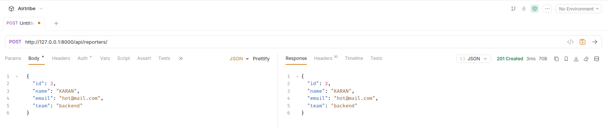
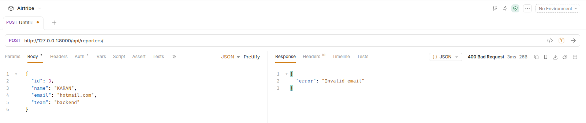
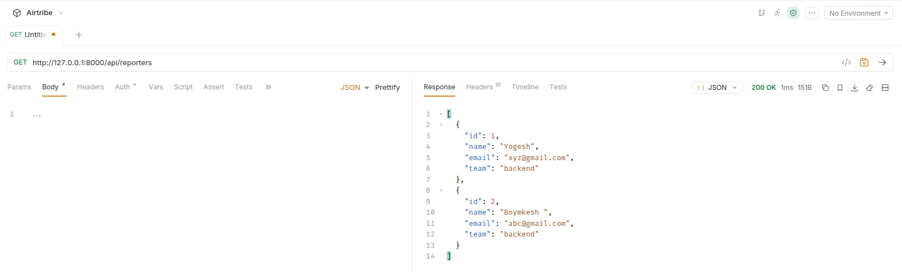
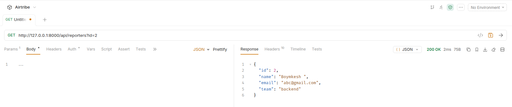
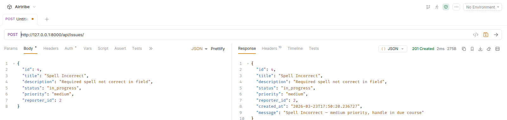
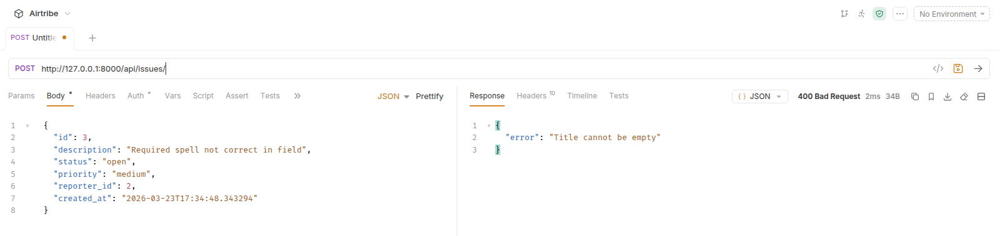
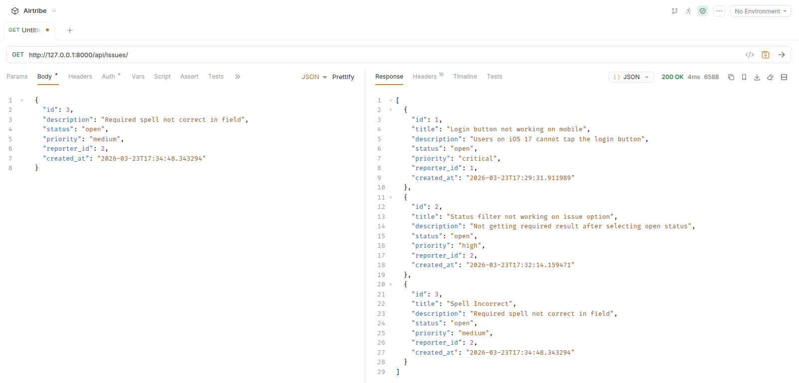
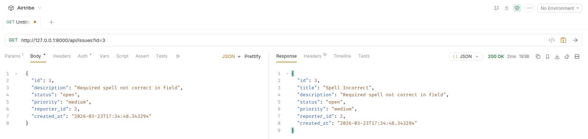
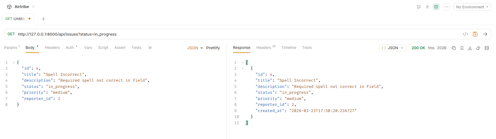

# DevTrack

DevTrack is a lightweight issue tracking backend built with Django.

It is designed as a stripped-down GitHub Issues style API where engineers can:

- report bugs
- assign priorities
- update statuses
- track issues across teams

The project uses function-based API endpoints and stores records in JSON files.


## How to Run the Project

### 1. Create and activate virtual environment

```bash
python3 -m venv .venv
source .venv/bin/activate
```

### 2. Install dependencies

```bash
pip install -r requirements.txt
```

### 3. Run the server

```bash
python manage.py runserver
```

The API will be available at:

```text
http://127.0.0.1:8000/
```

## API Endpoints

Base path:

```text
/api/
```

### Reporter Endpoints

#### `POST /api/reporters/`
Create a new reporter.

Request body example:

```json
{
  "id": 1,
  "name": "Yogesh",
  "email": "xyz@gmail.com",
  "team": "backend"
}
```



#### `GET /api/reporters/`
Get all reporters.


#### `GET /api/reporters/?id=1`
Get a single reporter by ID.



---

### Issue Endpoints

#### `POST /api/issues/`
Create a new issue.

Request body example:

```json
{
  "id": 1,
  "title": "Login button not working on mobile",
  "description": "Users on iOS 17 cannot tap the login button",
  "status": "open",
  "priority": "critical",
  "reporter_id": 1
}
```



#### `GET /api/issues/`
Get all issues.


#### `GET /api/issues/?id=1`
Get a single issue by ID.


#### `GET /api/issues/?status=open`
Get all issues filtered by status.


## Data Storage

This project stores data in JSON files in the project root:

- `reporters.json`
- `issues.json`

## Design Decisions

### Decision: Use shared `_load_records` and `_save_records` helper functions

I used centralized helper functions for file I/O instead of repeating read/write logic in every endpoint.

### Why this helps

- Keeps endpoint code focused on business logic (validation, filtering, response)
- Reduces duplication and improves maintainability
- Makes future changes (e.g., moving from JSON files to a database) easier because file access is isolated in one place
- Provides a cleaner and more consistent request flow across reporter and issue APIs

### Decision: Use collection handlers to route multiple operations per resource

I used `reporters_collection` and `issues_collection` as single entry points for each resource, then routed behavior by HTTP method and query parameters.

### Why this helps

- Keeps the URL design simple and predictable (`/api/reporters/`, `/api/issues/`)
- Reduces route and view boilerplate
- Makes request flow easier to understand in one place
- Creates a central place to add shared logic later (authentication, logging, validation)

### Trade-off

- As features grow, method branching in one collection function can become large, and splitting into dedicated handlers may improve readability.
